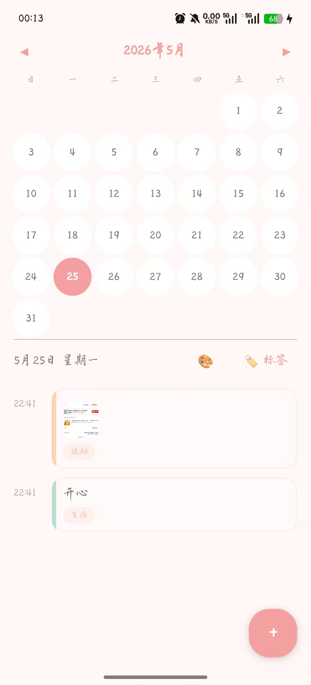
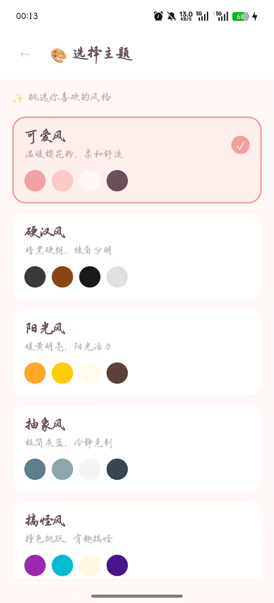
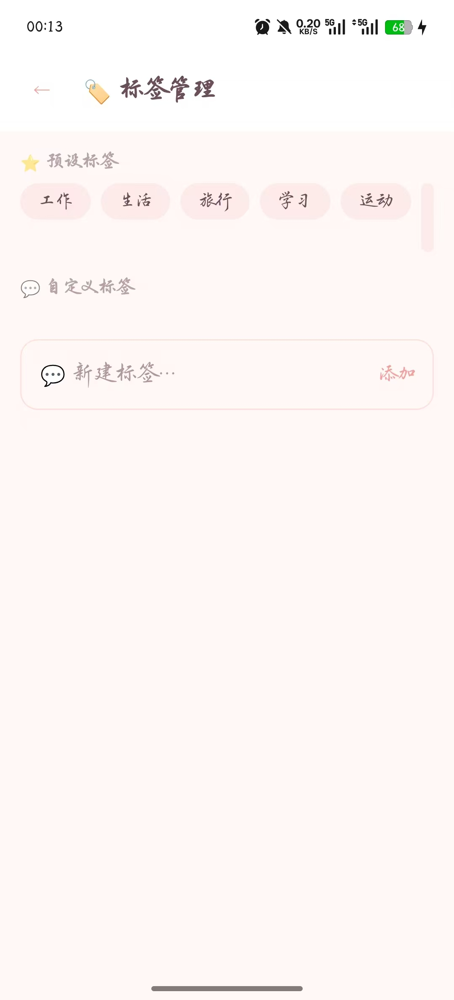
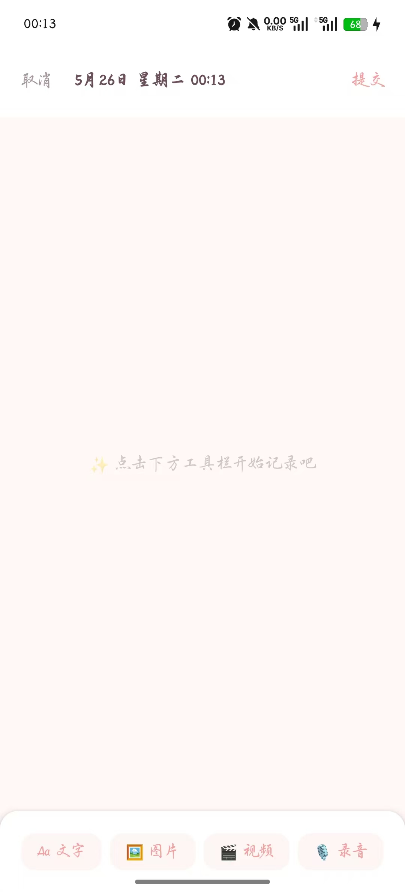

# 随时记 (Moment Journal)

一款本地优先的 Android 日记应用，让你随时随地记录当下发生的每一刻。

## 理念

不同于传统的一天一篇日记，**随时记** 支持一天内多次记录。文字、图片、视频、语音 — 自由组合在一个记录中，精确到秒的时间戳，按日期汇总浏览。

## 功能

- **日历浏览** — 月视图日历，有记录的日期标记圆点，选中日期查看当天时间线
- **自由编辑** — 像备忘录一样自由插入文字、图片、视频、语音内容块，长按拖拽排序
- **多媒体采集** — 支持即时拍摄/录制和相册/文件选取两种方式
- **标签系统** — 6 个预设标签 + 自定义标签，提交记录时选择
- **气泡编辑器** — 双指缩放、长按拖拽合并到同行，松手自动排列
- **5 套主题** — 可爱风(默认)、硬汉风、阳光风、抽象风、搞怪风
- **国际化** — 支持中文和英文，跟随手机系统语言

## 屏幕截图

| 主页 | 编辑器 | 详情 | 主题 |
|------|--------|------|------|
|  |  |  |  |

## 下载安装

[](https://github.com/hjm041226-ops/MomentJournal/raw/master/MomentJournal-v1.0-debug.apk)

> 点击上方按钮下载最新版 APK，直接安装到 Android 手机即可使用。

## 技术栈

| 层面 | 技术 |
|------|------|
| 语言 | Kotlin |
| UI | Jetpack Compose + Material 3 |
| 架构 | MVVM (ViewModel + StateFlow) |
| 数据库 | Room (SQLite) |
| 相机 | CameraX |
| 音频 | MediaRecorder |
| 图片加载 | Coil |
| 导航 | Navigation Compose |

## 构建

```bash
# 环境变量
export JAVA_HOME="<JDK 路径>"
export ANDROID_SDK_ROOT="<Android SDK 路径>"

# 构建
./gradlew assembleDebug

# 安装到设备
./gradlew installDebug
```

最低 SDK: Android 8.0 (API 26)  
目标 SDK: Android 14 (API 34)

## 许可证

MIT License
